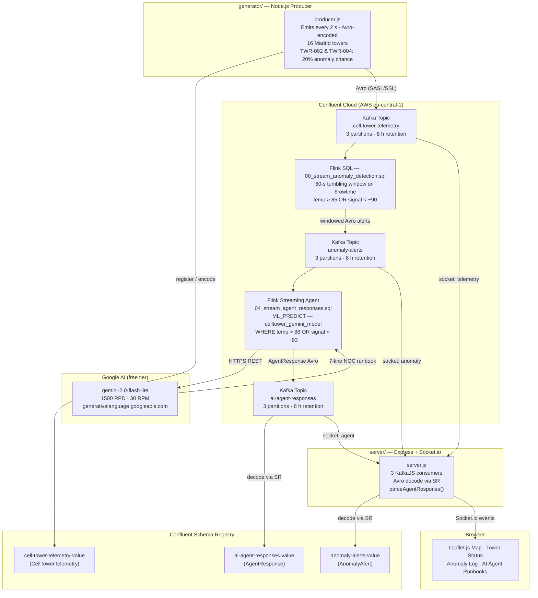

# 5G Cell Tower Anomaly Detection Demo

A real-time 5G cell tower telemetry monitoring demo set in **Madrid, Spain**. Mock telemetry is streamed into Confluent Cloud (Apache Kafka) encoded as **Avro** against a Schema Registry, aggregated by an Apache Flink SQL tumbling-window job to detect network anomalies, analysed by a **Confluent Flink Streaming Agent powered by Google Gemini** that produces per-alert NOC runbooks, and surfaced live in a Node.js web dashboard.

```
┌──────────────┐  KafkaJS/SASL+Avro  ┌─────────────────────────┐
│   Generator  │ ──────────────────► │  cell-tower-telemetry   │  Kafka topic
│  (producer)  │                     └────────────┬────────────┘
└──────────────┘                                  │ Flink SQL
                                                  ▼  (60-s tumbling window · $rowtime)
                                     ┌─────────────────────────┐
                                     │     anomaly-alerts      │  Kafka topic
                                     └────────────┬────────────┘
                                                  │ Flink ML_PREDICT
                                                  ▼  (gemini-2.0-flash-lite · WHERE temp>88 OR sig<-93)
                                     ┌─────────────────────────┐
                                     │   ai-agent-responses    │  Kafka topic
                                     └────────────┬────────────┘
                                                  │ KafkaJS consumers
                                                  ▼
                                     ┌─────────────────────────┐
                                     │  Express + Socket.io    │  server/
                                     │  ┌───────────────────┐  │
                                     │  │  Leaflet.js map   │  │  server/public/
                                     │  └───────────────────┘  │
                                     └─────────────────────────┘
```

---

## Demo Preview
https://github.com/user-attachments/assets/213c0617-9080-4649-a50a-9fdb31014987

> **▶ Click to play** — or [download the recording](video/5G_Network_Ops_Realtime_AI_CFLT_20260813_NS.mov) directly.

The recording shows the full end-to-end demo: the mock generator emitting Avro-encoded telemetry for 16 Madrid towers, the Flink SQL 60-second tumbling window surfacing anomaly alerts, tower markers flipping red on the Leaflet map, and the Gemini-powered AI Agent Runbooks panel showing live NOC diagnosis and next actions.

---

## Table of Contents

1. [Demo Preview](#demo-preview)
2. [Requirements](#requirements)
   - [Functional Requirements](#functional-requirements)
   - [Non-Functional Requirements](#non-functional-requirements)
3. [Technology Stack](#technology-stack)
4. [Project Structure](#project-structure)
5. [Architecture Overview](#architecture-overview)
6. [Prerequisites](#prerequisites)
7. [Scripts Reference](#scripts-reference)
8. [Setup & Execution](#setup--execution)
   - [Option A — Scripts (recommended)](#option-a--scripts-recommended)
   - [Option B — Manual step-by-step](#option-b--manual-step-by-step)
     - [Step 1 — Configure Terraform secrets](#step-1--configure-terraform-secrets)
     - [Step 2 — Provision infrastructure](#step-2--provision-infrastructure)
     - [Step 3 — Populate environment files](#step-3--populate-environment-files)
     - [Step 4 — Start the mock generator](#step-4--start-the-mock-generator)
     - [Step 5 — Start the dashboard server](#step-5--start-the-dashboard-server)
     - [Step 6 — Open the dashboard](#step-6--open-the-dashboard)
9. [Kafka Topics](#kafka-topics)
10. [Schema Registry](#schema-registry)
11. [Flink SQL — Anomaly Detection](#flink-sql--anomaly-detection)
12. [Streaming AI Agent (Flink + Gemini)](#streaming-ai-agent-flink--gemini)
13. [Telemetry Message Schema](#telemetry-message-schema)
14. [Anomaly Alert Message Schema](#anomaly-alert-message-schema)
15. [Agent Response Message Schema](#agent-response-message-schema)
16. [MCP Integration](#mcp-integration)
17. [Environment Variables Reference](#environment-variables-reference)
18. [Terraform Outputs Reference](#terraform-outputs-reference)
19. [Security](#security)
20. [Teardown](#teardown)
21. [Troubleshooting](#troubleshooting)

---

## Requirements

### Functional Requirements

| ID | Requirement |
|----|-------------|
| FR-01 | The system shall continuously produce mock 5G cell tower telemetry at a 2-second interval for **sixteen** towers located across Madrid: **Retiro (TWR-001)**, **Salamanca (TWR-002)**, **Chamberí (TWR-003)**, **Moncloa (TWR-004)**, **Vallecas (TWR-005)**, **Tetuán Centro (TWR-006)**, **Tetuán Norte (TWR-007)**, **Cuatro Caminos (TWR-008)**, **Hortaleza (TWR-009)**, **Carabanchel (TWR-010)**, **Arganzuela (TWR-011)**, **Usera (TWR-012)**, **Villaverde (TWR-013)**, **Moratalaz (TWR-014)**, **Barajas (TWR-015)**, and **La Latina (TWR-016)**. |
| FR-02 | Each telemetry message shall include `tower_id`, `tower_name`, `latitude`, `longitude`, `temperature` (°C), `signal_strength` (dBm), `cpu_load` (%), `event_time` (epoch milliseconds), and `is_anomaly` (boolean). |
| FR-03 | The generator shall randomly induce anomalous readings on **TWR-002 (Salamanca)** and **TWR-004 (Moncloa)** each with a 20% probability per emission cycle (`temperature` 88–95 °C, `signal_strength` −91 to −100 dBm), simulating hotspots in the north of the city. |
| FR-04 | All telemetry messages shall be published to the Kafka topic `cell-tower-telemetry` **Avro-encoded** against the Schema Registry subject `cell-tower-telemetry-value`. |
| FR-05 | A Flink SQL job shall aggregate anomalous events using a **60-second tumbling window** keyed on the Kafka message timestamp (`$rowtime`), filtering for `temperature > 85.0 °C` OR `signal_strength < -90.0 dBm`, and write windowed summaries to the `anomaly-alerts` topic. |
| FR-06 | Each anomaly alert shall include per-window statistics: `avg_temperature`, `avg_signal`, `max_temperature`, `min_signal`, `event_count`, `window_start`, and `window_end`. |
| FR-07 | A **Flink Streaming Agent** shall consume each anomaly alert from `anomaly-alerts`, call Google Gemini via `ML_PREDICT`, and write a structured NOC runbook to the `ai-agent-responses` topic. The runbook shall include: severity level, root-cause diagnosis, three immediate actions, escalation path, and ticket priority. |
| FR-08 | The web dashboard shall display a **Leaflet.js map centred on Madrid** with one marker per tower. |
| FR-09 | Tower markers shall turn **red** when an anomaly alert is received for that tower and automatically revert to green after 90 seconds if no further alert is received. |
| FR-10 | The dashboard shall display a **live stats sidebar** showing current temperature, signal strength, CPU load, and last-updated time per tower, updated in real time via Socket.io. |
| FR-11 | The dashboard shall maintain a scrollable **anomaly alerts log** and a dedicated **AI Agent Runbooks** view showing each Gemini-generated runbook with severity badge, diagnosis, numbered action steps, escalation callout, and ticket priority. |
| FR-12 | All Confluent Cloud infrastructure — including Kafka topics, Schema Registry schemas, Flink compute pool, service accounts, role bindings, API keys, and Flink SQL statements — shall be provisioned and destroyed via **Terraform** without manual UI interaction. |

### Non-Functional Requirements

| ID | Category | Requirement |
|----|----------|-------------|
| NFR-01 | **Security** | No credentials, API keys, or secrets shall be hardcoded in source files. All secrets are stored in `.env` files (gitignored) or supplied via `terraform.tfvars` (gitignored). The Google AI API key is injected via `templatefile()` in Terraform and never stored in the `.sql` source file. |
| NFR-02 | **Security** | Kafka access is controlled through Confluent RBAC **role bindings** (`CloudClusterAdmin`) on dedicated service accounts — not fine-grained ACLs. |
| NFR-03 | **Security** | A separate Terraform-only `EnvironmentAdmin` service account is used exclusively for infrastructure provisioning. Its API key is never embedded in application `.env` files. |
| NFR-04 | **Latency** | Telemetry events shall appear in the dashboard within **5 seconds** of being produced under normal network conditions. |
| NFR-05 | **Reliability** | Both Node.js processes (generator and server) handle `SIGINT` / `SIGTERM` with graceful shutdown, cleanly disconnecting all Kafka clients before exiting. |
| NFR-06 | **Maintainability** | All Flink SQL statements are stored as plain `.sql` files in `flink/` and applied via Terraform — none are executed ad-hoc. |
| NFR-07 | **Observability** | The generator prints a colour-coded ANSI table to stdout every 2 seconds. The server logs each anomaly alert and each AI agent response (including parsed severity). |
| NFR-08 | **Portability** | The `cloud_provider` and `region` Terraform variables default to `AWS / eu-central-1` (Frankfurt). Both can be overridden in `terraform.tfvars` without code changes. |
| NFR-09 | **Scalability** | All Kafka topics are created with **3 partitions**. The Flink compute pool is capped at `max_cfu = 5`, sufficient for the demo workload. |
| NFR-10 | **Consistency** | Topic naming follows lowercase kebab-case (`cell-tower-telemetry`, `anomaly-alerts`, `ai-agent-responses`). Terraform resource naming follows `<project>-<component>-<env>` (e.g., `celltower-producer-sa-dev`). Schema subjects follow the TopicNameStrategy (`<topic>-value`). |
| NFR-11 | **Rate limiting** | The Flink Streaming Agent only escalates windows where `avg_temperature > 88 °C` OR `avg_signal < -93 dBm` to the Gemini API, throttling call volume to protect free-tier API quotas. |

---

## Technology Stack

| Layer | Technology |
|-------|-----------|
| Infrastructure | [Terraform](https://www.terraform.io/) + [Confluent Cloud Provider](https://registry.terraform.io/providers/confluentinc/confluent/latest) `~> 2.0` |
| Message Broker | [Confluent Cloud](https://confluent.io/) — Apache Kafka (Basic cluster) |
| Schema Registry | Confluent Cloud Stream Governance Essentials (auto-provisioned with environment) |
| Serialisation | [Apache Avro](https://avro.apache.org/) via [`@confluentinc/schemaregistry`](https://www.npmjs.com/package/@confluentinc/schemaregistry) |
| Stream Processing | [Apache Flink SQL](https://docs.confluent.io/cloud/current/flink/index.html) on Confluent Cloud (60-second tumbling window) |
| Streaming AI Agent | Confluent Flink [`ML_PREDICT`](https://docs.confluent.io/cloud/current/flink/reference/functions/model-inference-functions.html) → **Google Gemini `gemini-2.0-flash-lite`** (`googleai` provider, `temperature=0.1`, `max_tokens=1024`) |
| Mock Producer | [Node.js](https://nodejs.org/) + [KafkaJS](https://kafka.js.org/) `^2.2` |
| Backend | [Express](https://expressjs.com/) `^4.19` + [Socket.io](https://socket.io/) `^4.7` + KafkaJS (3 consumers) |
| Frontend | HTML/CSS/JS + [Leaflet.js](https://leafletjs.com/) `1.9.4` + [CartoDB Voyager](https://carto.com/basemaps) tiles |
| AI / MCP | [`@confluentinc/mcp-confluent`](https://www.npmjs.com/package/@confluentinc/mcp-confluent) via stdio child process ([`server/mcp.js`](server/mcp.js)) |

---

## Project Structure

```
confluent-realtime-5g-telco/
├── .bobignore                    # Ignore rules for secrets and state
├── README.md                     # This file
│
├── schemas/                      # Avro schema source files
│   ├── cell-tower-telemetry-value.avsc   # CellTowerTelemetry record
│   ├── anomaly-alerts-value.avsc         # AnomalyAlert record
│   └── ai-agent-responses-value.avsc     # AgentResponse record (Streaming Agent output)
│
├── scripts/                      # All automation scripts
│   ├── lib/
│   │   └── common.sh             # Shared helpers (colours, prompts, PID management)
│   ├── infra-provision.sh        # Provision Confluent Cloud via Terraform
│   ├── infra-destroy.sh          # Tear down all Confluent Cloud resources
│   ├── infra-reset.sh            # Hard reset — wipes orphaned cloud resources + local state
│   ├── generate-mcp-config.sh    # Generate .bob/mcp.json + server/mcp-config/config.yaml
│   ├── generator-start.sh        # Start the mock telemetry producer
│   ├── generator-stop.sh         # Stop the mock telemetry producer
│   ├── dashboard-start.sh        # Start the web dashboard server
│   ├── dashboard-stop.sh         # Stop the web dashboard server
│   ├── demo-start.sh             # Start generator + dashboard together
│   └── demo-stop.sh              # Stop generator + dashboard together
│
├── terraform/
│   ├── versions.tf               # Terraform + provider version constraints
│   ├── variables.tf              # Input variable declarations (incl. google_api_key)
│   ├── confluent.tf              # Provider, environment, cluster, SA, RBAC, API keys, Flink pool
│   ├── topics.tf                 # Kafka topics: cell-tower-telemetry, anomaly-alerts
│   ├── schemas.tf                # Schema Registry resources for telemetry + anomaly schemas
│   ├── agent.tf                  # AI agent: ai-agent-responses topic + schema + 5 Flink statements
│   ├── outputs.tf                # Output values (keys, endpoints, env_config helper)
│   └── terraform.tfvars.example  # Template — copy to terraform.tfvars (incl. google_api_key)
│
├── flink/
│   ├── 00_stream_anomaly_detection.sql   # 60-s tumbling-window INSERT into anomaly-alerts
│   ├── 01a_drop_gemini_connection.sql    # DROP CONNECTION IF EXISTS (idempotency)
│   ├── 01b_create_gemini_connection.sql  # CREATE CONNECTION — googleai + gemini-2.0-flash-lite
│   ├── 02a_drop_gemini_model.sql         # DROP MODEL IF EXISTS $all (idempotency)
│   ├── 02b_create_gemini_model.sql       # CREATE MODEL — system prompt + Gemini params
│   └── 04_stream_agent_responses.sql     # ML_PREDICT INSERT into ai-agent-responses
│
├── generator/
│   ├── package.json              # kafkajs + @confluentinc/schemaregistry + dotenv
│   ├── producer.js               # KafkaJS Avro telemetry producer (16 Madrid towers)
│   └── .env.example              # Template — copy to .env
│
├── server/
│   ├── package.json              # express + socket.io + kafkajs + @confluentinc/schemaregistry
│   ├── server.js                 # Express + Socket.io + 3 Kafka consumers + response parser
│   ├── mcp.js                    # MCP client — spawns @confluentinc/mcp-confluent via stdio
│   ├── .env.example              # Template — copy to .env
│   ├── mcp-config/
│   │   └── config.yaml           # @confluentinc/mcp-confluent connection config
│   └── public/
│       └── index.html            # Leaflet map + stats sidebar + anomaly log + AI runbooks view
│
└── video/
    └── 5G_Network_Ops_Realtime_AI_CFLT_20260813_NS.mov   # Demo recording
```

---

## Architecture Overview



---

## Prerequisites

| Tool | Minimum version | Notes |
|------|----------------|-------|
| [Node.js](https://nodejs.org/) | 18 LTS | Used by generator and server |
| [npm](https://www.npmjs.com/) | 9 | Bundled with Node.js 18 |
| [Terraform](https://developer.hashicorp.com/terraform/install) | 1.5 | Used to provision all cloud resources |
| [jq](https://jqlang.github.io/jq/) | 1.6 | Required by `generate-mcp-config.sh` (`brew install jq`) |
| Confluent Cloud account | — | [Sign up free](https://confluent.cloud/signup) |
| Confluent Cloud API key | Cloud-level | Created in **Cloud API Keys** section of the Confluent Cloud console |
| Google AI API key | — | Create a free key at [aistudio.google.com/apikey](https://aistudio.google.com/apikey) — required for the Streaming Agent |

---

## Scripts Reference

All automation scripts live in [`scripts/`](scripts/). Every script sources [`scripts/lib/common.sh`](scripts/lib/common.sh) for shared colour output, interactive prompts, and PID-file process management.

| Script | Purpose | Interactive? |
|--------|---------|:---:|
| [`scripts/infra-provision.sh`](scripts/infra-provision.sh) | Guided Terraform wizard — asks for credentials, cloud/region, resource names, and Google API key, then provisions everything and writes `.env` files | ✅ |
| [`scripts/infra-destroy.sh`](scripts/infra-destroy.sh) | Tears down all Confluent Cloud resources. Shows a `terraform plan -destroy` preview and requires typing `DELETE` to confirm | ✅ |
| [`scripts/infra-reset.sh`](scripts/infra-reset.sh) | **Hard reset** — deletes the live environment via REST API, purges orphaned service accounts, and wipes all local state and credential files | ✅ |
| [`scripts/generate-mcp-config.sh`](scripts/generate-mcp-config.sh) | Reads Terraform outputs and writes `.bob/mcp.json` and `server/mcp-config/config.yaml`. Requires `jq` | ❌ |
| [`scripts/generator-start.sh`](scripts/generator-start.sh) | Validates `generator/.env`, installs npm packages if needed, launches the producer in the background | ✅ |
| [`scripts/generator-stop.sh`](scripts/generator-stop.sh) | Gracefully stops the running generator | ❌ |
| [`scripts/dashboard-start.sh`](scripts/dashboard-start.sh) | Validates `server/.env`, launches the dashboard in the background, opens the browser | ✅ |
| [`scripts/dashboard-stop.sh`](scripts/dashboard-stop.sh) | Gracefully stops the running dashboard | ❌ |
| [`scripts/demo-start.sh`](scripts/demo-start.sh) | **One-command start** — starts generator + dashboard and opens the browser | ✅ |
| [`scripts/demo-stop.sh`](scripts/demo-stop.sh) | **One-command stop** — stops generator + dashboard | ❌ |

> All scripts record running process IDs in `.pids/` (gitignored) so stop scripts can reliably locate and terminate background processes.

---

## Setup & Execution

### Option A — Scripts (recommended)

**First-time setup:**

```bash
# 1. Provision Confluent Cloud (asks for credentials + Google API key, writes .env files)
./scripts/infra-provision.sh

# 2. (Optional) Generate MCP config files for the AI agent and IBM Bob
./scripts/generate-mcp-config.sh

# 3. Start everything (opens browser automatically)
./scripts/demo-start.sh
```

**Daily use:**

```bash
./scripts/demo-start.sh   # start generator + dashboard
./scripts/demo-stop.sh    # stop generator + dashboard
```

**`infra-provision.sh` wizard steps:**

| Step | What it does |
|------|-------------|
| ① Check tools | Verifies `terraform`, `node`, and `npm` are installed |
| ② Credentials | Asks for your Confluent Cloud API key and secret |
| ③ Google API key | Asks for your Google AI Studio API key for the Streaming Agent |
| ④ Cloud & region | Numbered menu — Frankfurt (AWS) is the default |
| ⑤ Resource names | Optional environment suffix with sensible defaults |
| ⑥ Review | Summary of all choices — nothing is created yet |
| ⑦ Write config | Writes `terraform/terraform.tfvars` (gitignored) |
| ⑧ Terraform init | Downloads provider plugins |
| ⑨ Check orphans | Imports any existing service accounts to avoid `409 Conflict` |
| ⑩ Terraform plan | Lists every resource — pauses for confirmation |
| ⑪ Terraform apply | Creates all Confluent Cloud resources (~3–5 minutes) |
| ⑫ Write `.env` | Reads API keys and endpoints from Terraform outputs |
| ⑬ npm install | Installs Node.js packages for both services |
| ⑭ Summary | Prints next commands to run |

---

### Option B — Manual step-by-step

### Step 1 — Configure Terraform secrets

```bash
cd terraform
cp terraform.tfvars.example terraform.tfvars
```

Edit `terraform/terraform.tfvars`:

```hcl
confluent_cloud_api_key    = "YOUR_CLOUD_API_KEY"
confluent_cloud_api_secret = "YOUR_CLOUD_API_SECRET"
google_api_key             = "AIza…your-google-ai-key…"
```

> **Never commit `terraform.tfvars`** — it is listed in `.bobignore`.

---

### Step 2 — Provision infrastructure

```bash
cd terraform
terraform init
terraform plan  -var-file=terraform.tfvars
terraform apply -var-file=terraform.tfvars
```

Terraform creates the following resources in order:

1. Confluent environment `celltower-env-dev` (with Stream Governance Essentials — auto-provisions Schema Registry)
2. Kafka cluster `celltower-kafka-dev` (Basic, single-zone, `AWS / eu-central-1`)
3. Flink compute pool `celltower-flink-dev` (max 5 CFU)
4. Service accounts: `celltower-producer-sa-dev`, `celltower-consumer-sa-dev`, `celltower-admin-sa-dev`
5. RBAC role bindings (`EnvironmentAdmin`, `CloudClusterAdmin`, `FlinkDeveloper`, `ResourceOwner`)
6. API keys for producer, consumer, admin, Flink, and Schema Registry
7. `time_sleep` (15 s) — waits for the admin API key to propagate
8. Kafka topics `cell-tower-telemetry`, `anomaly-alerts`, `ai-agent-responses` (3 partitions, **8-hour retention**)
9. Avro schemas: `cell-tower-telemetry-value`, `anomaly-alerts-value`, `ai-agent-responses-value`
10. Flink statement `celltower-anomaly-detection-dev` — 60-second tumbling window
11. Flink AI agent pipeline (5 statements in sequence): DROP CONNECTION → CREATE CONNECTION → DROP MODEL → CREATE MODEL → INSERT with ML_PREDICT

---

### Step 3 — Populate environment files

```bash
# From inside terraform/
terraform output -raw env_config > ../generator/.env
terraform output -raw env_config > ../server/.env
```

**`generator/.env`:**

```dotenv
BOOTSTRAP_SERVERS=pkc-xxxxx.eu-central-1.aws.confluent.cloud:9092
PRODUCER_API_KEY=<producer_api_key>
PRODUCER_API_SECRET=<producer_api_secret>
SCHEMA_REGISTRY_URL=https://psrc-xxxxx.eu-central-1.aws.confluent.cloud
SCHEMA_REGISTRY_API_KEY=<schema_registry_api_key>
SCHEMA_REGISTRY_API_SECRET=<schema_registry_api_secret>
```

**`server/.env`:**

```dotenv
BOOTSTRAP_SERVERS=pkc-xxxxx.eu-central-1.aws.confluent.cloud:9092
CONSUMER_API_KEY=<consumer_api_key>
CONSUMER_API_SECRET=<consumer_api_secret>
SCHEMA_REGISTRY_URL=https://psrc-xxxxx.eu-central-1.aws.confluent.cloud
SCHEMA_REGISTRY_API_KEY=<schema_registry_api_key>
SCHEMA_REGISTRY_API_SECRET=<schema_registry_api_secret>
PORT=3000
```

---

### Step 4 — Start the mock generator

```bash
cd generator && npm install && npm start
```

Expected output (printed every 2 seconds; anomalous rows in red):

```
[generator] Batch @ 2024-07-15 12:00:02
──────────────────────────────────────────────────────────
TOWER-ID  NAME              TEMP(°C)  SIGNAL(dBm)  CPU(%)  ANOMALY
──────────────────────────────────────────────────────────
TWR-001   Retiro                72.4        -78.1    45.2  no
TWR-002   Salamanca             91.3        -96.4    92.1  ⚠ YES
TWR-003   Chamberí              68.9        -71.3    33.7  no
TWR-004   Moncloa               89.7        -93.2    87.5  ⚠ YES
...
```

---

### Step 5 — Start the dashboard server

```bash
cd server && npm install && npm start
```

Expected output:

```
[server] Dashboard running → http://localhost:3000
[server] 🚨 Anomaly received for TWR-002
[server] 🤖 Agent response for TWR-002 — severity: CRITICAL
```

---

### Step 6 — Open the dashboard

Navigate to **[http://localhost:3000](http://localhost:3000)**.

| UI element | Behaviour |
|------------|-----------|
| **Map** | Leaflet map centred on Madrid at zoom 13 with 16 tower markers |
| **Tower Status sidebar** | Live temperature, signal, CPU, and last-updated time per tower; values shown in red above anomaly thresholds |
| **Anomaly Alerts log** | Each windowed Flink alert as a card with per-window averages and event count |
| **AI Agent Runbooks** | Gemini-generated runbook cards with severity badge, diagnosis, numbered action steps, escalation callout, and ticket priority |
| **Marker colour** | Flips to **red** on anomaly alert; reverts to green after 90 seconds |

---

## Kafka Topics

| Topic | Partitions | Retention | Schema subject | Produced by | Consumed by |
|-------|-----------|-----------|---------------|-------------|-------------|
| `cell-tower-telemetry` | 3 | **8 hours** | `cell-tower-telemetry-value` | `generator/producer.js` | Flink SQL, `server/server.js` |
| `anomaly-alerts` | 3 | **8 hours** | `anomaly-alerts-value` | Flink SQL | `server/server.js`, Flink Streaming Agent |
| `ai-agent-responses` | 3 | **8 hours** | `ai-agent-responses-value` | Flink Streaming Agent | `server/server.js` |

---

## Schema Registry

All topic schemas are defined as Avro `.avsc` files in [`schemas/`](schemas/) and registered in Confluent Schema Registry by Terraform at deploy time.

| Subject | File | Record name | Registered by |
|---------|------|-------------|---------------|
| `cell-tower-telemetry-value` | [`schemas/cell-tower-telemetry-value.avsc`](schemas/cell-tower-telemetry-value.avsc) | `com.celltower.CellTowerTelemetry` | `terraform/schemas.tf` |
| `anomaly-alerts-value` | [`schemas/anomaly-alerts-value.avsc`](schemas/anomaly-alerts-value.avsc) | `com.celltower.AnomalyAlert` | `terraform/schemas.tf` |
| `ai-agent-responses-value` | [`schemas/ai-agent-responses-value.avsc`](schemas/ai-agent-responses-value.avsc) | `com.celltower.AgentResponse` | `terraform/agent.tf` |

---

## Flink SQL — Anomaly Detection

**File:** [`flink/00_stream_anomaly_detection.sql`](flink/00_stream_anomaly_detection.sql) — applied via Terraform as `confluent_flink_statement.anomaly_detection`. **Do not run ad-hoc.**

```sql
INSERT INTO `anomaly-alerts`
SELECT
  CAST(tower_id AS BYTES)                           AS key,
  tower_id,
  tower_name,
  latitude,
  longitude,
  AVG(temperature)                                  AS avg_temperature,
  AVG(signal_strength)                              AS avg_signal,
  MAX(temperature)                                  AS max_temperature,
  MIN(signal_strength)                              AS min_signal,
  COUNT(*)                                          AS event_count,
  CAST(window_start AS TIMESTAMP_LTZ(3))            AS window_start,
  CAST(window_end   AS TIMESTAMP_LTZ(3))            AS window_end
FROM TABLE(
  TUMBLE(TABLE `cell-tower-telemetry`, DESCRIPTOR(`$rowtime`), INTERVAL '60' SECOND)
)
WHERE temperature > 85.0
   OR signal_strength < -90.0
GROUP BY
  tower_id, tower_name, latitude, longitude, window_start, window_end;
```

**Key design decisions:**

| Decision | Reason |
|----------|--------|
| `DESCRIPTOR($rowtime)` | The only true time-attribute column available in the managed catalog without a `CREATE TABLE` / `WATERMARK` declaration |
| `CAST(tower_id AS BYTES) AS key` first | Confluent Flink exposes the Kafka message key as a leading `key: BYTES` sink column — must be supplied first |
| `latitude`, `longitude` in `GROUP BY` | Constant per tower — carries location data through to the alert without a join |
| `CAST(window_start/end AS TIMESTAMP_LTZ(3))` | `TUMBLE()` emits `TIMESTAMP(3)`; the sink expects `TIMESTAMP_LTZ(3)` |

---

## Streaming AI Agent (Flink + Gemini)

The agent is implemented as a Confluent Flink [`ML_PREDICT`](https://docs.confluent.io/cloud/current/flink/reference/functions/model-inference-functions.html) pipeline — no external process, no custom code. Flink SQL calls Google Gemini directly and writes the structured response back to Kafka.

### Flink SQL files (applied by `terraform/agent.tf` in order)

| Step | File | Statement | Purpose |
|------|------|-----------|---------|
| 1a | [`flink/01a_drop_gemini_connection.sql`](flink/01a_drop_gemini_connection.sql) | `DROP CONNECTION IF EXISTS` | Idempotent teardown before recreating |
| 1b | [`flink/01b_create_gemini_connection.sql`](flink/01b_create_gemini_connection.sql) | `CREATE CONNECTION` | Stores Google AI endpoint + API key (injected via `templatefile()`) |
| 2a | [`flink/02a_drop_gemini_model.sql`](flink/02a_drop_gemini_model.sql) | `DROP MODEL IF EXISTS $all` | Clears all model versions |
| 2b | [`flink/02b_create_gemini_model.sql`](flink/02b_create_gemini_model.sql) | `CREATE MODEL` | Registers `gemini-2.0-flash-lite` with system prompt |
| 3 | [`flink/04_stream_agent_responses.sql`](flink/04_stream_agent_responses.sql) | `INSERT … ML_PREDICT(…)` | Streaming pipeline — calls Gemini per alert, writes to `ai-agent-responses` |

### Model configuration

```sql
CREATE MODEL celltower_gemini_model
INPUT  (prompt STRING)
OUTPUT (response STRING)
WITH (
  'provider'                    = 'googleai',
  'task'                        = 'text_generation',
  'googleai.connection'         = 'celltower_gemini_connection',
  'googleai.system_prompt'      = 'You are a 5G NOC agent. Reply using ONLY these 7 lines:\nSEVERITY: CRITICAL|HIGH|MEDIUM|LOW\nDIAGNOSIS: <10 words max>\nACTION1: <action>\nACTION2: <action>\nACTION3: <action>\nESCALATION: <who and when>\nTICKET: P1|P2|P3|P4',
  'googleai.PARAMS.temperature' = '0.1',
  'googleai.PARAMS.max_tokens'  = '1024'
);
```

`temperature=0.1` makes responses maximally deterministic. `max_tokens=1024` gives comfortable headroom for the 7-line format.

> **Important:** The system prompt is a single-line SQL string — Flink SQL single-quoted literals do not preserve embedded newlines. The `\n` escape sequences are forwarded by the `googleai` provider as actual newlines in the API request.

### Streaming INSERT

```sql
INSERT INTO `ai-agent-responses`
SELECT
  CAST(tower_id AS BYTES) AS key,
  tower_id, tower_name, window_start, window_end,
  avg_temperature, avg_signal, max_temperature, min_signal, event_count,
  response                                     AS agent_response,
  CAST(NULL AS STRING)                         AS severity_level,
  CAST(NULL AS STRING)                         AS diagnosis,
  CAST(NULL AS STRING)                         AS immediate_actions,
  CAST(NULL AS STRING)                         AS escalation,
  CAST(NULL AS STRING)                         AS ticket_priority,
  CAST(CURRENT_TIMESTAMP AS TIMESTAMP_LTZ(3)) AS processed_at
FROM `anomaly-alerts`,
LATERAL TABLE(
  ML_PREDICT(
    'celltower_gemini_model',
    CONCAT('Tower:', tower_id, ' ', tower_name, CHR(10), …),
    MAP['async_enabled','false','retry_count','3','client_timeout','30']
  )
)
WHERE avg_temperature > 88.0
   OR avg_signal < -93.0;
```

### Rate-limit strategy

The free-tier `gemini-2.0-flash-lite` key has **1500 RPD / 30 RPM**. Three layers prevent quota exhaustion:

| Layer | Mechanism | Effect |
|-------|-----------|--------|
| **Severity filter** | `WHERE avg_temperature > 88 OR avg_signal < -93` — skips borderline anomaly windows | Reduces call volume ~60% at steady state; drastically limits catch-up replay on restart |
| **Synchronous mode** | `async_enabled=false` — one Gemini call in flight at a time; Flink backpressures the source | Physically impossible to burst above ~2 RPM |
| **Source parallelism** | `sql.tables.scan.source-operator-parallelism=1` in Terraform properties | Single reader thread; no parallel call fan-out |

### Response parsing (`server/server.js`)

The five structured fields (`severity_level`, `diagnosis`, `immediate_actions`, `escalation`, `ticket_priority`) are written as `NULL` by Flink and **parsed at read time** by `parseAgentResponse()` in [`server/server.js`](server/server.js). The parser extracts each labelled line from the raw `agent_response` text and enriches the payload before emitting it to the browser via Socket.io.

```js
// Labels matched: SEVERITY:, DIAGNOSIS:, ACTION1-3:, ESCALATION:, TICKET:
socket.on('agent', payload => {
  // Rendered as a runbook card in the AI Agent Runbooks view
});
```

### Terraform dependency chain

```
topic + schema
  └─► agent_drop_connection  (DROP CONNECTION IF EXISTS)
        └─► agent_connection       (CREATE CONNECTION — templatefile injects API key)
              └─► agent_drop_model  (DROP MODEL IF EXISTS $all)
              │      triggered also by: terraform_data.model_sql_hash (SHA256 of model SQL)
                    └─► agent_model       (CREATE MODEL with system prompt)
                              └─► agent_insert  (INSERT … ML_PREDICT — streaming pipeline)
```

`terraform_data.model_sql_hash` holds the SHA256 of [`flink/02b_create_gemini_model.sql`](flink/02b_create_gemini_model.sql). Any change to the model SQL automatically triggers the full drop/create/insert chain on the next `terraform apply`.

### Setup

**1. Obtain a Google AI Studio API key**

Go to [https://aistudio.google.com/apikey](https://aistudio.google.com/apikey) and create a free key. The free tier provides **1500 requests/day** and **30 requests/minute** for `gemini-2.0-flash-lite`.

**2. Add `google_api_key` to `terraform/terraform.tfvars`**

```hcl
google_api_key = "AIza…your-key…"
```

The key is declared `sensitive = true` in [`terraform/variables.tf`](terraform/variables.tf) and injected via `templatefile()` — it is never written to the `.sql` source file or to Terraform state in plaintext.

**3. Apply Terraform**

```bash
cd terraform && terraform apply -var-file=terraform.tfvars
```

**4. Verify the streaming pipeline**

Check the Flink statement is `RUNNING` in the Confluent Cloud console:
`Confluent Cloud → Environment → Flink → Statements → celltower-gemini-agent-dev`

Or consume agent responses directly:

```bash
confluent kafka topic consume ai-agent-responses --from-beginning
```

---

## Telemetry Message Schema

Avro record `com.celltower.CellTowerTelemetry`. Published to `cell-tower-telemetry`. Message key: `tower_id`.

| Field | Avro type | Description |
|-------|-----------|-------------|
| `tower_id` | `string` | Unique tower identifier, e.g. `TWR-001` |
| `tower_name` | `string` | Human-readable location name, e.g. `Retiro` |
| `latitude` | `double` | WGS-84 latitude |
| `longitude` | `double` | WGS-84 longitude |
| `temperature` | `double` | Hardware temperature in °C. Anomaly threshold: `> 85.0` |
| `signal_strength` | `double` | Downlink signal strength in dBm. Anomaly threshold: `< -90.0` |
| `cpu_load` | `double` | CPU utilisation percentage (0–100) |
| `event_time` | `{"type":"long","logicalType":"timestamp-millis"}` | Unix epoch milliseconds UTC |
| `is_anomaly` | `boolean` | `true` when the generator deliberately produced an anomalous reading |

**Example:**

```json
{
  "tower_id": "TWR-002", "tower_name": "Salamanca",
  "latitude": 40.4308, "longitude": -3.6800,
  "temperature": 91.4, "signal_strength": -96.1, "cpu_load": 88.3,
  "event_time": 1721039025000, "is_anomaly": true
}
```

---

## Anomaly Alert Message Schema

Avro record `com.celltower.AnomalyAlert`. Published to `anomaly-alerts` by Flink. Message key: `tower_id` (bytes).

| Field | Avro type | Description |
|-------|-----------|-------------|
| `tower_id` | `string` | Tower that triggered the anomaly window |
| `tower_name` | `string` | Human-readable location name |
| `latitude` | `double` | WGS-84 latitude |
| `longitude` | `double` | WGS-84 longitude |
| `avg_temperature` | `double` | Average temperature across the window (°C) |
| `avg_signal` | `double` | Average signal strength across the window (dBm) |
| `max_temperature` | `double` | Peak temperature in the window (°C) |
| `min_signal` | `double` | Worst signal strength in the window (dBm) |
| `event_count` | `long` | Number of anomalous events in the window |
| `window_start` | `timestamp-millis` | Inclusive window start (epoch milliseconds) |
| `window_end` | `timestamp-millis` | Exclusive window end (epoch milliseconds) |

**Example:**

```json
{
  "tower_id": "TWR-002", "tower_name": "Salamanca",
  "latitude": 40.4308, "longitude": -3.6800,
  "avg_temperature": 90.7, "avg_signal": -95.2,
  "max_temperature": 93.1, "min_signal": -98.4,
  "event_count": 4,
  "window_start": 1721039040000, "window_end": 1721039100000
}
```

---

## Agent Response Message Schema

Avro record `com.celltower.AgentResponse`. Published to `ai-agent-responses` by the Flink Streaming Agent. Message key: `tower_id` (bytes).

| Field | Avro type | Description |
|-------|-----------|-------------|
| `tower_id` | `string` | Tower identifier from the source alert |
| `tower_name` | `string` | Human-readable location name |
| `window_start` | `timestamp-millis` | Source anomaly window start |
| `window_end` | `timestamp-millis` | Source anomaly window end |
| `avg_temperature` | `double` | Window average temperature (°C) |
| `avg_signal` | `double` | Window average signal strength (dBm) |
| `max_temperature` | `double` | Window peak temperature (°C) |
| `min_signal` | `double` | Window worst signal (dBm) |
| `event_count` | `long` | Anomalous events in the window |
| `agent_response` | `string` | Full raw Gemini output — 7 labelled lines |
| `severity_level` | `["null","string"]` | Parsed: `CRITICAL`, `HIGH`, `MEDIUM`, or `LOW` (null if unparsed) |
| `diagnosis` | `["null","string"]` | Parsed one-line root-cause description |
| `immediate_actions` | `["null","string"]` | Parsed 3 action steps, newline-separated |
| `escalation` | `["null","string"]` | Parsed escalation path and trigger condition |
| `ticket_priority` | `["null","string"]` | Parsed: `P1`, `P2`, `P3`, or `P4` |
| `processed_at` | `timestamp-millis` | Flink write timestamp |

> The five parsed fields are written as `NULL` by Flink and populated by `parseAgentResponse()` in `server/server.js` at read time before being emitted to the dashboard via Socket.io.

**Example:**

```json
{
  "tower_id": "TWR-002", "tower_name": "Salamanca",
  "window_start": 1721039040000, "window_end": 1721039100000,
  "avg_temperature": 90.7, "avg_signal": -95.2,
  "max_temperature": 93.1, "min_signal": -98.4, "event_count": 4,
  "agent_response": "SEVERITY: CRITICAL\nDIAGNOSIS: Cooling fan failure causing thermal overload\nACTION1: Check cooling system via SSH\nACTION2: Reduce TX power by 3 dB\nACTION3: Dispatch field engineer\nESCALATION: RF team if temp exceeds 95C\nTICKET: P1",
  "severity_level": "CRITICAL",
  "diagnosis": "Cooling fan failure causing thermal overload",
  "immediate_actions": "1. Check cooling system via SSH\n2. Reduce TX power by 3 dB\n3. Dispatch field engineer",
  "escalation": "RF team if temp exceeds 95C",
  "ticket_priority": "P1",
  "processed_at": 1721039162000
}
```

---

## MCP Integration

[`scripts/generate-mcp-config.sh`](scripts/generate-mcp-config.sh) reads live Terraform outputs and writes two files:

| File | Purpose |
|------|---------|
| [`.bob/mcp.json`](.bob/mcp.json) | Registers the `confluent` MCP server in IBM Bob |
| [`server/mcp-config/config.yaml`](server/mcp-config/config.yaml) | Connection config for `@confluentinc/mcp-confluent` |

Pre-authorised tools (no per-call approval needed):

```
list-topics, list-flink-statements, list-flink-tables, list-flink-catalogs,
list-flink-databases, list-connectors, list-schemas, list-available-metrics,
list-clusters, list-compute-pools, search-product-docs
```

```bash
./scripts/generate-mcp-config.sh
# Then in IBM Bob: Cmd+Shift+P → "MCP: Reload Servers"
```

Requires `jq` (`brew install jq`) and an up-to-date Terraform state.

---

## Environment Variables Reference

### `generator/.env`

| Variable | Required | Description |
|----------|----------|-------------|
| `BOOTSTRAP_SERVERS` | ✅ | Confluent Kafka bootstrap endpoint (strip `SASL_SSL://` prefix) |
| `PRODUCER_API_KEY` | ✅ | API key ID for `celltower-producer-sa-dev` |
| `PRODUCER_API_SECRET` | ✅ | API key secret for `celltower-producer-sa-dev` |
| `SCHEMA_REGISTRY_URL` | ✅ | Schema Registry REST endpoint |
| `SCHEMA_REGISTRY_API_KEY` | ✅ | Schema Registry API key ID |
| `SCHEMA_REGISTRY_API_SECRET` | ✅ | Schema Registry API key secret |

### `server/.env`

| Variable | Required | Description |
|----------|----------|-------------|
| `BOOTSTRAP_SERVERS` | ✅ | Confluent Kafka bootstrap endpoint |
| `CONSUMER_API_KEY` | ✅ | API key ID for `celltower-consumer-sa-dev` |
| `CONSUMER_API_SECRET` | ✅ | API key secret for `celltower-consumer-sa-dev` |
| `SCHEMA_REGISTRY_URL` | ✅ | Schema Registry REST endpoint |
| `SCHEMA_REGISTRY_API_KEY` | ✅ | Schema Registry API key ID |
| `SCHEMA_REGISTRY_API_SECRET` | ✅ | Schema Registry API key secret |
| `PORT` | ❌ | HTTP port for Express server (default: `3000`) |

> The `google_api_key` is consumed only by Terraform — it is never needed in any application `.env` file.

---

## Terraform Outputs Reference

| Output | Sensitive | Description |
|--------|:---------:|-------------|
| `environment_id` | | Confluent Cloud environment ID |
| `kafka_cluster_id` | | Kafka cluster ID |
| `flink_compute_pool_id` | | Flink compute pool ID |
| `bootstrap_endpoint` | ✅ | Kafka bootstrap endpoint (includes `SASL_SSL://` prefix) |
| `kafka_rest_endpoint` | | Kafka cluster REST endpoint |
| `flink_rest_endpoint` | | Flink REST endpoint |
| `schema_registry_url` | | Schema Registry REST endpoint |
| `schema_registry_api_key` | ✅ | Schema Registry API key ID |
| `schema_registry_api_secret` | ✅ | Schema Registry API key secret |
| `producer_api_key` | ✅ | Producer API key ID |
| `producer_api_secret` | ✅ | Producer API key secret |
| `consumer_api_key` | ✅ | Consumer API key ID |
| `consumer_api_secret` | ✅ | Consumer API key secret |
| `flink_api_key` | ✅ | Flink API key ID |
| `flink_api_secret` | ✅ | Flink API key secret |
| `connection_info` | | Structured map of all endpoints and IDs |
| `confluent_cloud_console_urls` | | Direct browser links to the Confluent Cloud console |
| `env_config` | ✅ | Ready-to-paste `.env` content for both services |
| `next_steps` | | Post-deploy instructions |

```bash
terraform output -json connection_info         # all endpoints as JSON
terraform output -raw env_config              # paste-ready .env block
terraform output confluent_cloud_console_urls # browser links
terraform output next_steps                   # post-deploy checklist
```

---

## Security

- **No secrets in source control.** `.env`, `terraform.tfvars`, `*.tfstate`, `*.tfstate.backup`, and the Google AI API key are listed in `.bobignore`.
- **Google API key never in SQL source.** [`flink/01b_create_gemini_connection.sql`](flink/01b_create_gemini_connection.sql) uses a `${google_api_key}` placeholder; the actual value is injected by `templatefile()` in Terraform at plan time and never written to the `.sql` file.
- **Least-privilege RBAC.** Three dedicated service accounts:
  - `celltower-producer-sa-dev` — `CloudClusterAdmin` on the Kafka cluster (required for Avro schema registration on a Basic cluster).
  - `celltower-consumer-sa-dev` — `CloudClusterAdmin` on the Kafka cluster (read access to all topics).
  - `celltower-admin-sa-dev` — `EnvironmentAdmin` + `FlinkDeveloper` + `ResourceOwner`. Used exclusively by Terraform; its API key is never distributed to application processes.
- **TLS + SASL/PLAIN.** All Kafka connections use SSL with SASL PLAIN authentication.

---

## Teardown

**Normal teardown:**

```bash
./scripts/infra-destroy.sh
```

Shows a `terraform plan -destroy` preview and requires typing `DELETE` to confirm. Purges orphaned service accounts and offers to remove generated `.env` and `terraform.tfvars` files.

**Hard reset** (state out of sync):

```bash
./scripts/infra-reset.sh
```

Deletes the live Confluent Cloud environment via REST (cascade-deletes all resources), purges service accounts, and wipes all local state files.

| Situation | Use |
|-----------|-----|
| Normal end-of-demo cleanup | `infra-destroy.sh` |
| Terraform state out of sync | `infra-reset.sh` |
| Start completely from scratch | `infra-reset.sh` → `infra-provision.sh` |

---

## Troubleshooting

### Flink statement fails with `timecol must be a time attribute`

`TUMBLE()` requires a **time attribute** column. Avro `timestamp-millis` fields resolve to plain `TIMESTAMP_LTZ(3)` data columns in the managed catalog. Use `DESCRIPTOR($rowtime)` (the Kafka message timestamp) — the only true time attribute available without a `CREATE TABLE` declaration.

### Flink statement fails with `Different number of columns`

The `INSERT INTO` column list must match the sink schema exactly. The `ai-agent-responses` sink has 17 columns (including 5 nullable structured fields). The SQL supplies all 17, with `CAST(NULL AS STRING)` for the 5 parsed fields.

### Flink streaming agent fails with `429 Too Many Requests`

The free-tier `gemini-2.0-flash-lite` key has **1500 RPD**. If the daily quota is exhausted (from replaying a large `anomaly-alerts` backlog across multiple failed restarts), wait until midnight Pacific time for the quota to reset. The `WHERE avg_temperature > 88 OR avg_signal < -93` filter and `sql.tables.scan.source-operator-parallelism=1` prevent this from happening under normal operation.

If 429s persist at steady state, add `'debug','true'` to the `ML_PREDICT` MAP to surface Google's raw error body, which identifies the specific quota type.

### Kafka topic resources fail with `401 Unauthorized`

Confluent Cloud Kafka API keys have a ~15-second propagation delay after creation. Terraform includes a `time_sleep` resource that enforces this wait. Re-running `terraform apply` will succeed once the key has propagated.

### `terraform apply` fails with `409 Conflict` on service accounts

Service accounts are org-scoped and survive environment deletion. `infra-provision.sh` runs an orphan-import step that detects and imports them automatically. If running Terraform manually:

```bash
terraform import -var-file=terraform.tfvars confluent_service_account.cluster_admin <sa-id>
```

### State is out of sync after a failed provision

```bash
./scripts/infra-reset.sh
./scripts/infra-provision.sh
```

### Schema registration fails with `TYPE_MISMATCH` compatibility error

[`terraform/schemas.tf`](terraform/schemas.tf) temporarily sets subject compatibility to `NONE` via a `null_resource` curl call before registration, then restores `BACKWARD`. If this step fails, set the compatibility manually in the Schema Registry UI for the `cell-tower-telemetry-value` subject, then re-run `terraform apply`.

### `generate-mcp-config.sh` fails with `Could not determine ORGANIZATION_ID`

Run `terraform apply -refresh-only` to refresh the state, then re-run the script.

### Changing the model prompt or `max_tokens` has no effect after `terraform apply`

The `agent_model` statement is immutable — the provider cannot update it in place. Changes to [`flink/02b_create_gemini_model.sql`](flink/02b_create_gemini_model.sql) are detected via the `terraform_data.model_sql_hash` sentinel resource (SHA256 of the file). When the hash changes, the full drop/create/insert chain is triggered automatically on the next `terraform apply`.
