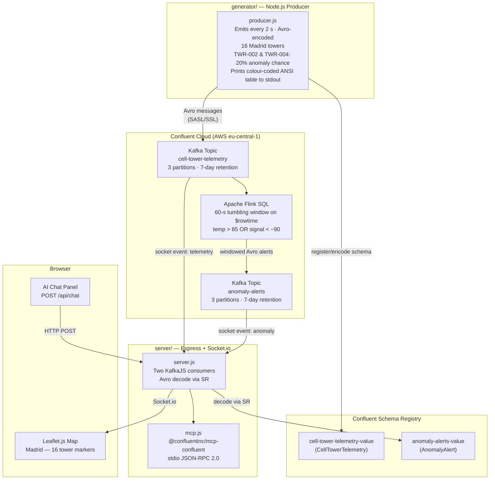

# 5G Cell Tower Anomaly Detection Demo

A real-time 5G cell tower telemetry monitoring demo set in **Madrid, Spain**. Mock telemetry is streamed into Confluent Cloud (Apache Kafka) encoded as **Avro** against a Schema Registry, aggregated by an Apache Flink SQL tumbling-window job to detect network anomalies, and surfaced live in a Node.js web dashboard. An AI agent powered by the Confluent MCP server can be wired into the dashboard for natural-language queries over the stream.

```
┌──────────────┐  KafkaJS/SASL+Avro  ┌─────────────────────────┐
│   Generator  │ ──────────────────► │  cell-tower-telemetry   │  Kafka topic
│  (producer)  │                     └────────────┬────────────┘
└──────────────┘                                  │ Flink SQL
                                                  ▼  (60-s tumbling window · $rowtime)
                                     ┌─────────────────────────┐
                                     │     anomaly-alerts      │  Kafka topic
                                     └────────────┬────────────┘
                                                  │ KafkaJS consumers
                                                  ▼
                                     ┌─────────────────────────┐
                                     │  Express + Socket.io    │  server/
                                     │  ┌───────────────────┐  │
                                     │  │  Leaflet.js map   │  │  server/public/
                                     │  │  AI Chat (MCP)    │  │
                                     │  └───────────────────┘  │
                                     └─────────────────────────┘
```

---

## Table of Contents

1. [Requirements](#requirements)
   - [Functional Requirements](#functional-requirements)
   - [Non-Functional Requirements](#non-functional-requirements)
2. [Technology Stack](#technology-stack)
3. [Project Structure](#project-structure)
4. [Architecture Overview](#architecture-overview)
5. [Prerequisites](#prerequisites)
6. [Scripts Reference](#scripts-reference)
7. [Setup & Execution](#setup--execution)
   - [Option A — Scripts (recommended)](#option-a--scripts-recommended)
   - [Option B — Manual step-by-step](#option-b--manual-step-by-step)
     - [Step 1 — Configure Terraform secrets](#step-1--configure-terraform-secrets)
     - [Step 2 — Provision infrastructure](#step-2--provision-infrastructure)
     - [Step 3 — Populate environment files](#step-3--populate-environment-files)
     - [Step 4 — Start the mock generator](#step-4--start-the-mock-generator)
     - [Step 5 — Start the dashboard server](#step-5--start-the-dashboard-server)
     - [Step 6 — Open the dashboard](#step-6--open-the-dashboard)
8. [Kafka Topics](#kafka-topics)
9. [Schema Registry](#schema-registry)
10. [Flink SQL Statement](#flink-sql-statement)
11. [Telemetry Message Schema](#telemetry-message-schema)
12. [Anomaly Alert Message Schema](#anomaly-alert-message-schema)
13. [MCP Integration](#mcp-integration)
14. [Environment Variables Reference](#environment-variables-reference)
15. [Terraform Outputs Reference](#terraform-outputs-reference)
16. [Security](#security)
17. [Teardown](#teardown)
18. [Troubleshooting](#troubleshooting)

---

## Requirements

### Functional Requirements

| ID | Requirement |
|----|-------------|
| FR-01 | The system shall continuously produce mock 5G cell tower telemetry at a 2-second interval for **sixteen** towers located across Madrid: **Retiro (TWR-001)**, **Salamanca (TWR-002)**, **Chamberí (TWR-003)**, **Moncloa (TWR-004)**, **Vallecas (TWR-005)**, **Tetuán Centro (TWR-006)**, **Tetuán Norte (TWR-007)**, **Cuatro Caminos (TWR-008)**, **Hortaleza (TWR-009)**, **Carabanchel (TWR-010)**, **Arganzuela (TWR-011)**, **Usera (TWR-012)**, **Villaverde (TWR-013)**, **Moratalaz (TWR-014)**, **Barajas (TWR-015)**, and **La Latina (TWR-016)**. |
| FR-02 | Each telemetry message shall include `tower_id`, `tower_name`, `latitude`, `longitude`, `temperature` (°C), `signal_strength` (dBm), `cpu_load` (%), `event_time` (epoch milliseconds), and `is_anomaly` (boolean). |
| FR-03 | The generator shall randomly induce anomalous readings on **TWR-002 (Salamanca)** and **TWR-004 (Moncloa)** each with a 20% probability per emission cycle (`temperature` 88–95 °C, `signal_strength` −91 to −100 dBm), simulating hotspots in the north of the city. |
| FR-04 | All telemetry messages shall be published to the Kafka topic `cell-tower-telemetry` **Avro-encoded** against the Schema Registry subject `cell-tower-telemetry-value`. |
| FR-05 | A Flink SQL job shall aggregate anomalous events using a **60-second tumbling window** keyed on the Kafka message timestamp (`$rowtime`), filtering for `temperature > 85.0 °C` OR `signal_strength < -90.0 dBm`, and write windowed summaries to the `anomaly-alerts` topic. |
| FR-06 | Each anomaly alert shall include per-window statistics: `avg_temperature`, `avg_signal`, `max_temperature`, `min_signal`, `event_count`, `window_start`, and `window_end`. |
| FR-07 | The web dashboard shall display a **Leaflet.js map centred on Madrid** with one marker per tower. |
| FR-08 | Tower markers shall turn **red** when an anomaly alert is received for that tower and automatically revert to green after 90 seconds if no further alert is received. |
| FR-09 | The dashboard shall display a **live stats sidebar** showing current temperature, signal strength, CPU load, and last-updated time per tower, updated in real time via Socket.io. |
| FR-10 | The dashboard shall maintain a scrollable **anomaly alerts log** listing each detected anomaly with window statistics and timestamp. |
| FR-11 | The dashboard shall expose an **AI chat panel** backed by `server/mcp.js`, which routes natural-language prompts to `@confluentinc/mcp-confluent` via stdio JSON-RPC 2.0. A `POST /api/chat` endpoint in `server/server.js` is required to wire the panel to the MCP client (not yet implemented — see [MCP Integration](#mcp-integration)). |
| FR-12 | All Confluent Cloud infrastructure — including Kafka topics, Schema Registry schemas, Flink compute pool, service accounts, role bindings, API keys, and the Flink SQL statement — shall be provisioned and destroyed via **Terraform** without manual UI interaction. |

### Non-Functional Requirements

| ID | Category | Requirement |
|----|----------|-------------|
| NFR-01 | **Security** | No credentials, API keys, or secrets shall be hardcoded in source files. All secrets are stored in `.env` files (gitignored) or supplied via `terraform.tfvars` (gitignored). |
| NFR-02 | **Security** | Kafka access is controlled through Confluent RBAC **role bindings** (`CloudClusterAdmin`) on dedicated service accounts — not fine-grained ACLs. |
| NFR-03 | **Security** | A separate Terraform-only `EnvironmentAdmin` service account is used exclusively for infrastructure provisioning. Its API key is never embedded in application `.env` files. |
| NFR-04 | **Latency** | Telemetry events shall appear in the dashboard within **5 seconds** of being produced under normal network conditions. |
| NFR-05 | **Reliability** | Both Node.js processes (generator and server) handle `SIGINT` / `SIGTERM` with graceful shutdown, cleanly disconnecting all Kafka clients before exiting. |
| NFR-06 | **Reliability** | The MCP child process auto-respawns on unexpected exit; in-flight requests are rejected with a descriptive error so the HTTP response is never silently dropped. |
| NFR-07 | **Maintainability** | The Flink SQL statement is stored as a plain `.sql` file in `flink/` and applied via Terraform — it is never executed ad-hoc. Changing the window size requires updating the `INTERVAL` in `flink/anomaly_detection.sql` **and** the anomaly thresholds in `generator/producer.js`. |
| NFR-08 | **Observability** | The generator prints a colour-coded ANSI table to stdout every 2 seconds listing all 16 towers with their current temperature, signal strength, CPU load, and anomaly status. Anomalous rows are highlighted in red. The server logs each received anomaly alert and Socket.io connection lifecycle events. |
| NFR-09 | **Portability** | The `cloud_provider` and `region` Terraform variables default to `AWS / eu-central-1` (Frankfurt). Both can be overridden in `terraform.tfvars` without code changes. |
| NFR-10 | **Scalability** | Both Kafka topics are created with **3 partitions**. The Flink compute pool is capped at `max_cfu = 5`, sufficient for the demo workload and adjustable via the `flink_max_cfu` variable. |
| NFR-11 | **Consistency** | Topic naming follows lowercase kebab-case (`cell-tower-telemetry`, `anomaly-alerts`). Terraform resource naming follows `<project>-<component>-<env>` (e.g., `celltower-producer-sa-dev`). Schema subjects follow the TopicNameStrategy (`<topic>-value`). |

---

## Technology Stack

| Layer | Technology |
|-------|-----------|
| Infrastructure | [Terraform](https://www.terraform.io/) + [Confluent Cloud Provider](https://registry.terraform.io/providers/confluentinc/confluent/latest) `~> 2.0`, `hashicorp/null ~> 3.0`, `hashicorp/time ~> 0.11` |
| Message Broker | [Confluent Cloud](https://confluent.io/) — Apache Kafka (Basic cluster) |
| Schema Registry | Confluent Cloud Stream Governance Essentials (auto-provisioned with environment) |
| Serialisation | [Apache Avro](https://avro.apache.org/) via [`@confluentinc/schemaregistry`](https://www.npmjs.com/package/@confluentinc/schemaregistry) |
| Stream Processing | [Apache Flink SQL](https://docs.confluent.io/cloud/current/flink/index.html) via Confluent Cloud Flink (1.19+) |
| Mock Producer | [Node.js](https://nodejs.org/) + [KafkaJS](https://kafka.js.org/) `^2.2` |
| Backend | [Express](https://expressjs.com/) `^4.19` + [Socket.io](https://socket.io/) `^4.7` + KafkaJS |
| Frontend | HTML/CSS/JS + [Leaflet.js](https://leafletjs.com/) `1.9.4` + [CartoDB Dark Matter](https://carto.com/basemaps) tiles |
| AI Integration | [`@confluentinc/mcp-confluent`](https://www.npmjs.com/package/@confluentinc/mcp-confluent) via stdio JSON-RPC 2.0 (see [`server/mcp.js`](server/mcp.js)) |

---

## Project Structure

```
confluent-realtime-demo/
├── .bobignore                    # Ignore rules for secrets and state
├── README.md                     # This file
│
├── schemas/                      # ★ Avro schema source files
│   ├── cell-tower-telemetry-value.avsc   # CellTowerTelemetry record
│   └── anomaly-alerts-value.avsc         # AnomalyAlert record
│
├── scripts/                      # ★ All automation scripts
│   ├── lib/
│   │   └── common.sh             # Shared helpers (colours, prompts, PID management)
│   ├── infra-provision.sh        # Provision Confluent Cloud via Terraform
│   ├── infra-destroy.sh          # Tear down all Confluent Cloud resources
│   ├── infra-reset.sh            # Hard reset — wipes orphaned cloud resources + local state
│   ├── generate-mcp-config.sh    # Generate .bob/mcp.json + server/mcp-config/config.yaml from Terraform outputs
│   ├── generator-start.sh        # Start the mock telemetry producer
│   ├── generator-stop.sh         # Stop the mock telemetry producer
│   ├── dashboard-start.sh        # Start the web dashboard server
│   ├── dashboard-stop.sh         # Stop the web dashboard server
│   ├── demo-start.sh             # Start generator + dashboard together
│   └── demo-stop.sh              # Stop generator + dashboard together
│
├── terraform/
│   ├── versions.tf               # Terraform + provider version constraints
│   ├── variables.tf              # Input variable declarations
│   ├── confluent.tf              # Provider, environment, cluster, SA, role bindings, API keys, Flink
│   ├── topics.tf                 # Kafka topic resources
│   ├── schemas.tf                # Schema Registry schema resources
│   ├── outputs.tf                # Output values (keys, endpoints, env_config helper)
│   └── terraform.tfvars.example  # Template — copy to terraform.tfvars
│
├── flink/
│   └── anomaly_detection.sql     # Flink SQL 60-s tumbling-window INSERT
│
├── generator/
│   ├── package.json              # kafkajs + @confluentinc/schemaregistry + dotenv
│   ├── producer.js               # KafkaJS Avro telemetry producer (16 Madrid towers)
│   └── .env.example              # Template — copy to .env
│
└── server/
    ├── package.json              # express + socket.io + kafkajs + @confluentinc/schemaregistry + dotenv
    ├── server.js                 # Express + Socket.io server + two Kafka consumers
    ├── mcp.js                    # MCP stdio child-process client (queryMcp helper)
    ├── mcp-config/
    │   └── config.yaml           # @confluentinc/mcp-confluent connection config (generated by generate-mcp-config.sh)
    ├── .env.example              # Template — copy to .env
    └── public/
        └── index.html            # Leaflet map + live stats + alerts log + AI chat panel
```

---

## Architecture Overview



---

## Prerequisites

| Tool | Minimum version | Notes |
|------|----------------|-------|
| [Node.js](https://nodejs.org/) | 18 LTS | Used by generator and server |
| [npm](https://www.npmjs.com/) | 9 | Bundled with Node.js 18 |
| [Terraform](https://developer.hashicorp.com/terraform/install) | 1.5 | Used to provision all cloud resources |
| [jq](https://jqlang.github.io/jq/) | 1.6 | Required by `generate-mcp-config.sh` (`brew install jq`) |
| Confluent Cloud account | — | [Sign up free](https://confluent.cloud/signup) |
| Confluent Cloud API key | Cloud-level | Created in **Cloud API Keys** section of the Confluent Cloud console |

---

## Scripts Reference

All automation scripts live in [`scripts/`](scripts/). Every script sources [`scripts/lib/common.sh`](scripts/lib/common.sh) for shared colour output, interactive prompts, and PID-file process management.

| Script | Purpose | Interactive? |
|--------|---------|:---:|
| [`scripts/infra-provision.sh`](scripts/infra-provision.sh) | Guided Terraform wizard — asks for credentials, cloud/region, and resource names, then provisions everything in Confluent Cloud and writes `.env` files | ✅ |
| [`scripts/infra-destroy.sh`](scripts/infra-destroy.sh) | Tears down all Confluent Cloud resources. Shows a `terraform plan -destroy` preview and requires typing `DELETE` to confirm | ✅ |
| [`scripts/infra-reset.sh`](scripts/infra-reset.sh) | **Hard reset** — use when Terraform state is out of sync with Confluent Cloud. Deletes the live environment via REST API, purges orphaned service accounts, and wipes all local state and credential files. Run before re-provisioning from scratch | ✅ |
| [`scripts/generate-mcp-config.sh`](scripts/generate-mcp-config.sh) | Reads Terraform outputs and writes `.bob/mcp.json` (IBM Bob MCP integration) and `server/mcp-config/config.yaml` (`@confluentinc/mcp-confluent` connection config). Requires `jq` and an up-to-date Terraform state | ❌ |
| [`scripts/generator-start.sh`](scripts/generator-start.sh) | Validates `generator/.env`, checks for a running instance, installs npm packages if needed, launches the producer in the background, and tails the log | ✅ |
| [`scripts/generator-stop.sh`](scripts/generator-stop.sh) | Gracefully stops the running generator (SIGTERM → SIGKILL fallback) | ❌ |
| [`scripts/dashboard-start.sh`](scripts/dashboard-start.sh) | Validates `server/.env`, optionally changes the HTTP port, launches the dashboard in the background, and opens the browser | ✅ |
| [`scripts/dashboard-stop.sh`](scripts/dashboard-stop.sh) | Gracefully stops the running dashboard | ❌ |
| [`scripts/demo-start.sh`](scripts/demo-start.sh) | **One-command start** — starts both generator and dashboard, then opens the browser | ✅ |
| [`scripts/demo-stop.sh`](scripts/demo-stop.sh) | **One-command stop** — stops both generator and dashboard | ❌ |

> All scripts record running process IDs in `.pids/` (gitignored) so stop scripts can reliably locate and terminate the background processes.

---

## Setup & Execution

### Option A — Scripts (recommended)

The scripts in [`scripts/`](scripts/) handle every phase of the demo lifecycle. No prior Terraform or Confluent knowledge is required.

**First-time setup — provision cloud infrastructure and start the demo:**

```bash
# 1. Provision Confluent Cloud (asks questions, writes .env files, installs packages)
./scripts/infra-provision.sh

# 2. (Optional) Generate MCP config files for the AI agent and IBM Bob
./scripts/generate-mcp-config.sh

# 3. Start everything with one command (opens browser automatically)
./scripts/demo-start.sh
```

**Daily use — after infrastructure is already provisioned:**

```bash
./scripts/demo-start.sh   # start generator + dashboard
./scripts/demo-stop.sh    # stop generator + dashboard
```

**Manage services individually:**

```bash
./scripts/generator-start.sh   # start only the data generator
./scripts/generator-stop.sh    # stop only the data generator
./scripts/dashboard-start.sh   # start only the web dashboard
./scripts/dashboard-stop.sh    # stop only the web dashboard
```

**`infra-provision.sh` wizard steps:**

| Step | What it does |
|------|-------------|
| ① Check tools | Verifies `terraform`, `node`, and `npm` are installed — offers to auto-install anything missing |
| ② Credentials | Asks for your Confluent Cloud API key and secret with step-by-step console navigation instructions |
| ③ Cloud & region | Numbered menu of cloud providers (AWS / GCP / Azure) and regions — Frankfurt (AWS) is the default |
| ④ Resource names | Optional environment suffix (e.g. `dev`, `prod`) with sensible defaults for all resource names |
| ⑤ Review | Summary of all choices — nothing is created yet |
| ⑥ Write config | Writes `terraform/terraform.tfvars` — gitignored, never committed |
| ⑦ Terraform init | Downloads provider plugins (Confluent, null, time) — takes ~30 s |
| ⑧ Check orphans | Detects any service accounts that already exist in your org and imports them to avoid `409 Conflict` |
| ⑨ Terraform plan | Lists every resource to be created — pauses for confirmation |
| ⑩ Terraform apply | Creates all Confluent Cloud resources (~3–5 minutes) |
| ⑪ Write `.env` | Reads API keys and bootstrap endpoint from Terraform outputs, writes `generator/.env` and `server/.env` |
| ⑫ npm install | Installs Node.js packages for both services |
| ⑬ Summary | Prints the next commands to run |

> **Prerequisites before running the scripts:**
> 1. A [Confluent Cloud account](https://confluent.cloud/signup) (free tier is sufficient)
> 2. A **Cloud-level** API key — go to **Confluent Cloud console → your name (top-right) → API Keys → + Add key → Global access**
> 3. `terraform`, `node`, and `npm` installed (`infra-provision.sh` checks and guides you if anything is missing)

---

### Option B — Manual step-by-step

Use this path if you prefer full control or need to customise the Terraform run.

### Step 1 — Configure Terraform secrets

```bash
cd terraform
cp terraform.tfvars.example terraform.tfvars
```

Edit `terraform/terraform.tfvars` and replace the placeholder values with your **Cloud-level** Confluent API key and secret (not cluster-level):

```hcl
confluent_cloud_api_key    = "YOUR_CLOUD_API_KEY"
confluent_cloud_api_secret = "YOUR_CLOUD_API_SECRET"
```

> **Never commit `terraform.tfvars`** — it is listed in `.bobignore`.

---

### Step 2 — Provision infrastructure

```bash
cd terraform
terraform init
terraform plan  -var-file=terraform.tfvars   # review the plan
terraform apply -var-file=terraform.tfvars   # type "yes" to confirm
```

Terraform creates the following resources in order:

1. Confluent environment `celltower-env-dev` (with Stream Governance Essentials — auto-provisions Schema Registry)
2. Kafka cluster `celltower-kafka-dev` (Basic, single-zone, `AWS / eu-central-1`)
3. Flink compute pool `celltower-flink-dev` (max 5 CFU)
4. Service accounts: `celltower-producer-sa-dev`, `celltower-consumer-sa-dev`, `celltower-admin-sa-dev`
5. RBAC role bindings (`EnvironmentAdmin`, `CloudClusterAdmin`, `FlinkDeveloper`, `ResourceOwner`)
6. API keys for producer, consumer, admin, Flink, and Schema Registry service accounts
7. `time_sleep` (15 s) — waits for the admin Kafka API key to propagate before creating topics
8. Kafka topics `cell-tower-telemetry` and `anomaly-alerts` (3 partitions, 7-day retention)
9. Schema compatibility override for `cell-tower-telemetry-value` subject (set to `NONE` via REST, then restored to `BACKWARD` after registration)
10. Avro schemas registered in Schema Registry: `cell-tower-telemetry-value`, `anomaly-alerts-value`
11. Flink SQL statement `celltower-anomaly-detection-dev` (from `flink/anomaly_detection.sql`)

---

### Step 3 — Populate environment files

The quickest way is to use the `env_config` Terraform output, which generates ready-to-use `.env` content for both services:

```bash
# From inside terraform/
terraform output -raw env_config > ../generator/.env
terraform output -raw env_config > ../server/.env
```

> The `env_config` output contains credentials for **all** roles (producer, consumer, Schema Registry, Flink, MCP). Each service only reads the variables it needs — unused variables are silently ignored by `dotenv`.

Alternatively, populate each file manually from individual outputs:

```bash
terraform output -raw bootstrap_endpoint         # → BOOTSTRAP_SERVERS (strip SASL_SSL:// prefix)
terraform output -raw producer_api_key           # → PRODUCER_API_KEY
terraform output -raw producer_api_secret        # → PRODUCER_API_SECRET
terraform output -raw consumer_api_key           # → CONSUMER_API_KEY
terraform output -raw consumer_api_secret        # → CONSUMER_API_SECRET
terraform output -raw schema_registry_url        # → SCHEMA_REGISTRY_URL
terraform output -raw schema_registry_api_key    # → SCHEMA_REGISTRY_API_KEY
terraform output -raw schema_registry_api_secret # → SCHEMA_REGISTRY_API_SECRET
```

**`generator/.env`** (create from template):

```bash
cd ../generator && cp .env.example .env
```

```dotenv
BOOTSTRAP_SERVERS=pkc-xxxxx.eu-central-1.aws.confluent.cloud:9092
PRODUCER_API_KEY=<producer_api_key from Terraform>
PRODUCER_API_SECRET=<producer_api_secret from Terraform>
SCHEMA_REGISTRY_URL=https://psrc-xxxxx.eu-central-1.aws.confluent.cloud
SCHEMA_REGISTRY_API_KEY=<schema_registry_api_key from Terraform>
SCHEMA_REGISTRY_API_SECRET=<schema_registry_api_secret from Terraform>
```

**`server/.env`** (create from template):

```bash
cd ../server && cp .env.example .env
```

```dotenv
BOOTSTRAP_SERVERS=pkc-xxxxx.eu-central-1.aws.confluent.cloud:9092
CONSUMER_API_KEY=<consumer_api_key from Terraform>
CONSUMER_API_SECRET=<consumer_api_secret from Terraform>
SCHEMA_REGISTRY_URL=https://psrc-xxxxx.eu-central-1.aws.confluent.cloud
SCHEMA_REGISTRY_API_KEY=<schema_registry_api_key from Terraform>
SCHEMA_REGISTRY_API_SECRET=<schema_registry_api_secret from Terraform>
PORT=3000
```

---

### Step 4 — Start the mock generator

Open a terminal window:

```bash
cd generator
npm install
npm start
```

Expected output (a full ANSI table is printed every 2 seconds; anomalous rows are highlighted in red):

```
[generator] Connected. Producing Avro telemetry for Madrid towers...

[generator] Batch @ 2024-07-15 12:00:02
──────────────────────────────────────────────────────────
TOWER-ID  NAME              TEMP(°C)  SIGNAL(dBm)  CPU(%)  ANOMALY
──────────────────────────────────────────────────────────
TWR-001   Retiro                72.4        -78.1    45.2  no
TWR-002   Salamanca             91.3        -96.4    92.1  ⚠ YES   ← red row
TWR-003   Chamberí              68.9        -71.3    33.7  no
TWR-004   Moncloa               89.7        -93.2    87.5  ⚠ YES   ← red row
TWR-005   Vallecas              75.1        -80.5    52.0  no
...
──────────────────────────────────────────────────────────
```

The generator emits one Avro-encoded message per tower every **2 seconds** across all 16 towers. TWR-002 (Salamanca) and TWR-004 (Moncloa) each randomly produce anomalous readings with a 20% probability per cycle.

---

### Step 5 — Start the dashboard server

Open a second terminal window:

```bash
cd server
npm install
npm start
```

Expected output:

```
[server] Dashboard running → http://localhost:3000
[server] Browser connected: <socket-id>
[server] 🚨 Anomaly received for TWR-002
```

---

### Step 6 — Open the dashboard

Navigate to **[http://localhost:3000](http://localhost:3000)** in a browser.

| UI element | Behaviour |
|------------|-----------|
| **Map** | Leaflet dark map centred on Madrid at zoom 13. Sixteen green markers covering Retiro, Salamanca, Chamberí, Moncloa, Vallecas, Tetuán Centro, Tetuán Norte, Cuatro Caminos, Hortaleza, Carabanchel, Arganzuela, Usera, Villaverde, Moratalaz, Barajas, and La Latina. |
| **Tower Status sidebar** | Live temperature, signal strength, CPU load, and last-updated time per tower. Values shown in red when they exceed anomaly thresholds (`temp > 85 °C`, `signal < −90 dBm`). |
| **Anomaly Alerts log** | Each windowed alert from Flink appears as a card with per-window averages and event count. Newest entries appear at the top. |
| **Marker colour** | Flips to **red** when an anomaly alert is received. Automatically reverts to green after 90 seconds if no further alert arrives. |
| **AI Chat panel** | Requires wiring `server/mcp.js` into `server/server.js` — see [MCP Integration](#mcp-integration). |

---

## Kafka Topics

| Topic | Partitions | Retention | Schema subject | Produced by | Consumed by |
|-------|-----------|-----------|---------------|-------------|-------------|
| `cell-tower-telemetry` | 3 | 7 days | `cell-tower-telemetry-value` | `generator/producer.js` | Flink SQL, `server/server.js` |
| `anomaly-alerts` | 3 | 7 days | `anomaly-alerts-value` | Flink SQL | `server/server.js` |

---

## Schema Registry

Both topic schemas are defined as Avro `.avsc` files in [`schemas/`](schemas/) and registered in Confluent Schema Registry by Terraform at deploy time using the `confluent_schema` resource ([`terraform/schemas.tf`](terraform/schemas.tf)).

| Subject | File | Record name |
|---------|------|-------------|
| `cell-tower-telemetry-value` | [`schemas/cell-tower-telemetry-value.avsc`](schemas/cell-tower-telemetry-value.avsc) | `com.celltower.CellTowerTelemetry` |
| `anomaly-alerts-value` | [`schemas/anomaly-alerts-value.avsc`](schemas/anomaly-alerts-value.avsc) | `com.celltower.AnomalyAlert` |

Naming follows the default **TopicNameStrategy** (`<topic-name>-value`), which is what `@confluentinc/schemaregistry` uses when registering and looking up schemas by subject name.

The `event_time` field uses Avro `{"type": "long", "logicalType": "timestamp-millis"}`. Confluent Flink maps this to `TIMESTAMP_LTZ(3)`. The Confluent Cloud provider does not expose a subject-level compatibility resource, so [`terraform/schemas.tf`](terraform/schemas.tf) uses a `null_resource` with a `local-exec` curl call to temporarily set the subject compatibility to `NONE` before registering the updated schema, then restores it to `BACKWARD` afterwards.

The Flink SQL statement is only submitted **after** both schemas are registered (enforced via `depends_on` in [`terraform/confluent.tf`](terraform/confluent.tf)), ensuring the Flink managed catalog can resolve column types from Schema Registry automatically — no `CREATE TABLE` statement is required.

---

## Flink SQL Statement

**File:** [`flink/anomaly_detection.sql`](flink/anomaly_detection.sql)

Applied via the `confluent_flink_statement` Terraform resource — **do not run ad-hoc**.

```sql
INSERT INTO `anomaly-alerts`
SELECT
  -- Kafka message key column (first in sink schema)
  CAST(tower_id AS BYTES)                           AS key,
  tower_id,
  -- Location fields: constant per tower so safe to include in GROUP BY
  tower_name,
  latitude,
  longitude,
  AVG(temperature)                                  AS avg_temperature,
  AVG(signal_strength)                              AS avg_signal,
  MAX(temperature)                                  AS max_temperature,
  MIN(signal_strength)                              AS min_signal,
  COUNT(*)                                          AS event_count,
  CAST(window_start AS TIMESTAMP_LTZ(3))            AS window_start,
  CAST(window_end   AS TIMESTAMP_LTZ(3))            AS window_end
FROM TABLE(
  -- Use $rowtime (Kafka message timestamp) — the only true time attribute
  -- available in the managed catalog without a CREATE TABLE statement.
  TUMBLE(TABLE `cell-tower-telemetry`, DESCRIPTOR(`$rowtime`), INTERVAL '60' SECOND)
)
WHERE temperature > 85.0
   OR signal_strength < -90.0
GROUP BY
  tower_id,
  tower_name,
  latitude,
  longitude,
  window_start,
  window_end;
```

**Key design decisions:**

| Decision | Reason |
|----------|--------|
| `DESCRIPTOR(`$rowtime`)` instead of `DESCRIPTOR(event_time)` | `$rowtime` is Confluent Flink's built-in event-time watermark sourced from the Kafka message timestamp — the only column that carries the time-attribute marker required by `TUMBLE()` without a `CREATE TABLE` / `WATERMARK` declaration. Avro `timestamp-millis` fields are plain `TIMESTAMP_LTZ(3)` data columns and cannot be used directly in `TUMBLE()`. |
| `CAST(tower_id AS BYTES) AS key` as the first column | Confluent Flink's managed catalog exposes the raw Kafka message key as a leading `key: BYTES` column in the sink schema. The `INSERT INTO` column list must match positionally, so the key must be supplied first. |
| `tower_name`, `latitude`, `longitude` in `GROUP BY` | These are constant per tower, so grouping on them is safe and carries location data through to the alert without a join. |
| `CAST(window_start/end AS TIMESTAMP_LTZ(3))` | `TUMBLE()` emits `window_start` / `window_end` as `TIMESTAMP(3)` (no timezone). The `anomaly-alerts` sink schema uses `timestamp-millis` → `TIMESTAMP_LTZ(3)`, so an explicit cast is required. |

- **Filter:** `temperature > 85.0 OR signal_strength < -90.0`
- **Window:** `TUMBLE(… INTERVAL '60' SECOND)` — one aggregated row per tower per closed 60-second window.
- **Aggregates per window:** `AVG`, `MAX` temperature; `AVG`, `MIN` signal strength; `COUNT` of matching events.

> ⚠️ Do not change the `60 SECOND` interval without also reviewing the anomaly induction probability in [`generator/producer.js`](generator/producer.js) and the 90-second auto-reset timeout in [`server/public/index.html`](server/public/index.html).

---

## Telemetry Message Schema

Avro record `com.celltower.CellTowerTelemetry`. Published to `cell-tower-telemetry`. Message key: `tower_id` (string).

| Field | Avro type | Description |
|-------|-----------|-------------|
| `tower_id` | `string` | Unique tower identifier, e.g. `TWR-001` |
| `tower_name` | `string` | Human-readable location name, e.g. `Retiro` |
| `latitude` | `double` | WGS-84 latitude |
| `longitude` | `double` | WGS-84 longitude |
| `temperature` | `double` | Hardware temperature in °C. Anomaly threshold: `> 85.0` |
| `signal_strength` | `double` | Downlink signal strength in dBm. Anomaly threshold: `< -90.0` |
| `cpu_load` | `double` | CPU utilisation percentage (0–100) |
| `event_time` | `{"type":"long","logicalType":"timestamp-millis"}` | Unix epoch milliseconds UTC. Maps to `TIMESTAMP_LTZ(3)` in Flink. |
| `is_anomaly` | `boolean` | `true` when the generator deliberately produced an anomalous reading |

**Example value:**

```json
{
  "tower_id":        "TWR-002",
  "tower_name":      "Salamanca",
  "latitude":        40.4308,
  "longitude":       -3.6800,
  "temperature":     91.4,
  "signal_strength": -96.1,
  "cpu_load":        88.3,
  "event_time":      1721039025000,
  "is_anomaly":      true
}
```

---

## Anomaly Alert Message Schema

Avro record `com.celltower.AnomalyAlert`. Published to `anomaly-alerts` by Flink. Message key: `tower_id` (bytes, set by Flink from the `key` column).

| Field | Avro type | Description |
|-------|-----------|-------------|
| `tower_id` | `string` | Tower that triggered the anomaly window |
| `tower_name` | `string` | Human-readable tower location name, e.g. `Salamanca` |
| `latitude` | `double` | WGS-84 latitude of the tower |
| `longitude` | `double` | WGS-84 longitude of the tower |
| `avg_temperature` | `double` | Average temperature across anomalous readings in the window (°C) |
| `avg_signal` | `double` | Average signal strength across anomalous readings in the window (dBm) |
| `max_temperature` | `double` | Peak temperature in the window (°C) |
| `min_signal` | `double` | Worst signal strength in the window (dBm) |
| `event_count` | `long` | Number of anomalous events in the window |
| `window_start` | `{"type":"long","logicalType":"timestamp-millis"}` | Inclusive window start (epoch milliseconds) |
| `window_end` | `{"type":"long","logicalType":"timestamp-millis"}` | Exclusive window end (epoch milliseconds) |

**Example value:**

```json
{
  "tower_id":        "TWR-002",
  "tower_name":      "Salamanca",
  "latitude":        40.4308,
  "longitude":       -3.6800,
  "avg_temperature": 90.7,
  "avg_signal":      -95.2,
  "max_temperature": 93.1,
  "min_signal":      -98.4,
  "event_count":     4,
  "window_start":    1721039040000,
  "window_end":      1721039100000
}
```

---

## MCP Integration

The project includes a fully-functional MCP client module ([`server/mcp.js`](server/mcp.js)) that spawns `@confluentinc/mcp-confluent` as a stdio child process and exposes a `queryMcp(prompt)` function. The module includes:

- **Prompt routing** — keyword-based dispatch to the appropriate MCP tool (`list-topics`, `list-flink-statements`, `list-schemas`, `search-product-docs`, etc.)
- **Auto-respawn** — the child process restarts automatically on unexpected exit
- **Timeout + rejection** — in-flight requests are rejected with a descriptive error if the child exits mid-request

**Current status:** `server/mcp.js` is implemented but is not yet wired into `server/server.js`. To enable the AI chat panel, add a `POST /api/chat` route to `server/server.js`:

```js
const { queryMcp } = require('./mcp');

app.post('/api/chat', async (req, res) => {
  try {
    const text = await queryMcp(req.body.prompt || '');
    res.json({ reply: text });
  } catch (err) {
    res.status(500).json({ error: err.message });
  }
});
```

**Credential mapping:** `mcp.js` maps `server/.env` variables to the names expected by `@confluentinc/mcp-confluent`:

| `server/.env` variable | MCP env variable |
|------------------------|-----------------|
| `SCHEMA_REGISTRY_URL` | `SCHEMA_REGISTRY_ENDPOINT` |
| `CONSUMER_API_KEY` | `KAFKA_API_KEY` |
| `CONSUMER_API_SECRET` | `KAFKA_API_SECRET` |

### IBM Bob MCP integration

[`scripts/generate-mcp-config.sh`](scripts/generate-mcp-config.sh) writes two files from live Terraform outputs:

| File | Purpose |
|------|---------|
| `.bob/mcp.json` | Registers the `confluent` MCP server in IBM Bob, passing all credentials as environment variables to the `npx @confluentinc/mcp-confluent` process |
| `server/mcp-config/config.yaml` | Connection config consumed by `@confluentinc/mcp-confluent` — declares Kafka, Schema Registry, Confluent Cloud, and Flink endpoints |

Run it after `terraform apply`:

```bash
./scripts/generate-mcp-config.sh
# Then in IBM Bob: Cmd+Shift+P → "MCP: Reload Servers"
```

Requires `jq` (`brew install jq`) and an up-to-date Terraform state.

---

## Environment Variables Reference

### `generator/.env`

| Variable | Required | Source | Description |
|----------|----------|--------|-------------|
| `BOOTSTRAP_SERVERS` | ✅ | `terraform output -raw bootstrap_endpoint` (strip `SASL_SSL://`) | Confluent Kafka bootstrap endpoint |
| `PRODUCER_API_KEY` | ✅ | `terraform output -raw producer_api_key` | API key ID for `celltower-producer-sa-dev` |
| `PRODUCER_API_SECRET` | ✅ | `terraform output -raw producer_api_secret` | API key secret for `celltower-producer-sa-dev` |
| `SCHEMA_REGISTRY_URL` | ✅ | `terraform output -raw schema_registry_url` | Schema Registry REST endpoint |
| `SCHEMA_REGISTRY_API_KEY` | ✅ | `terraform output -raw schema_registry_api_key` | Schema Registry API key ID |
| `SCHEMA_REGISTRY_API_SECRET` | ✅ | `terraform output -raw schema_registry_api_secret` | Schema Registry API key secret |

### `server/.env`

| Variable | Required | Source | Description |
|----------|----------|--------|-------------|
| `BOOTSTRAP_SERVERS` | ✅ | `terraform output -raw bootstrap_endpoint` (strip `SASL_SSL://`) | Confluent Kafka bootstrap endpoint |
| `CONSUMER_API_KEY` | ✅ | `terraform output -raw consumer_api_key` | API key ID for `celltower-consumer-sa-dev` |
| `CONSUMER_API_SECRET` | ✅ | `terraform output -raw consumer_api_secret` | API key secret for `celltower-consumer-sa-dev` |
| `SCHEMA_REGISTRY_URL` | ✅ | `terraform output -raw schema_registry_url` | Schema Registry REST endpoint |
| `SCHEMA_REGISTRY_API_KEY` | ✅ | `terraform output -raw schema_registry_api_key` | Schema Registry API key ID |
| `SCHEMA_REGISTRY_API_SECRET` | ✅ | `terraform output -raw schema_registry_api_secret` | Schema Registry API key secret |
| `PORT` | ❌ | — | HTTP port for the Express server (default: `3000`) |

---

## Terraform Outputs Reference

After `terraform apply`, the following outputs are available:

| Output | Sensitive | Description |
|--------|:---------:|-------------|
| `environment_id` | | Confluent Cloud environment ID |
| `kafka_cluster_id` | | Kafka cluster ID |
| `flink_compute_pool_id` | | Flink compute pool ID |
| `bootstrap_endpoint` | ✅ | Kafka bootstrap endpoint (includes `SASL_SSL://` prefix) |
| `kafka_rest_endpoint` | | Kafka cluster REST endpoint |
| `flink_rest_endpoint` | | Flink REST endpoint |
| `schema_registry_url` | | Schema Registry REST endpoint |
| `schema_registry_api_key` | ✅ | Schema Registry API key ID |
| `schema_registry_api_secret` | ✅ | Schema Registry API key secret |
| `producer_api_key` | ✅ | Producer API key ID |
| `producer_api_secret` | ✅ | Producer API key secret |
| `consumer_api_key` | ✅ | Consumer API key ID |
| `consumer_api_secret` | ✅ | Consumer API key secret |
| `flink_api_key` | ✅ | Flink API key ID |
| `flink_api_secret` | ✅ | Flink API key secret |
| `connection_info` | | Structured map of all endpoints and IDs |
| `confluent_cloud_console_urls` | | Direct browser links to the Confluent Cloud console |
| `env_config` | ✅ | Ready-to-paste `.env` content for both services |
| `next_steps` | | Post-deploy instructions |

```bash
# Common output commands
terraform output -json connection_info          # all endpoints as JSON
terraform output -raw env_config               # paste-ready .env block
terraform output confluent_cloud_console_urls  # browser links
terraform output next_steps                    # post-deploy checklist
```

---

## Security

- **No secrets in source control.** `.env`, `terraform.tfvars`, `*.tfstate`, and `*.tfstate.backup` are listed in `.bobignore`.
- **Least-privilege RBAC.** Three dedicated service accounts are created:
  - `celltower-producer-sa-dev` — `CloudClusterAdmin` on the Kafka cluster (required for Avro schema registration and topic produce on a Basic cluster).
  - `celltower-consumer-sa-dev` — `CloudClusterAdmin` on the Kafka cluster (read access to both topics).
  - `celltower-admin-sa-dev` — `EnvironmentAdmin` + `FlinkDeveloper` + `ResourceOwner` on Schema Registry subjects. Used exclusively by Terraform; its API key is never distributed to application processes.
- **TLS + SASL/PLAIN.** All Kafka connections use SSL with SASL PLAIN authentication — credentials are never sent in plaintext over the wire.
- **MCP credentials.** The MCP child process (`server/mcp.js`) inherits the server process environment, which is populated from `server/.env` at startup. No separate credential file is needed for the AI agent.

---

## Teardown

**Normal teardown** — use when Terraform state is in sync with Confluent Cloud:

```bash
./scripts/infra-destroy.sh
```

The destroy script shows a `terraform plan -destroy` preview of every resource that will be removed, then requires typing `DELETE` (all caps) to confirm. It also purges any orphaned service accounts and offers to remove the generated `.env` and `terraform.tfvars` files.

**Hard reset** — use when state is out of sync (e.g. after a failed provision, partial destroy, or manual UI changes):

```bash
./scripts/infra-reset.sh
```

This script bypasses Terraform entirely, deletes the live Confluent Cloud environment directly via the REST API (cascade-deleting all resources within it), purges service accounts, and wipes all local state files. After it completes, run `./scripts/infra-provision.sh` to start fresh.

| Situation | Use |
|-----------|-----|
| Normal end-of-demo cleanup | `infra-destroy.sh` |
| Terraform state out of sync with cloud | `infra-reset.sh` |
| Start completely from scratch | `infra-reset.sh` → `infra-provision.sh` |

---

## Troubleshooting

### Flink statement fails with `timecol must be a time attribute`

Flink's `TUMBLE()` requires a **time attribute** column, not a plain data column. Avro `timestamp-millis` fields resolve to `TIMESTAMP_LTZ(3)` as regular data columns in the managed catalog — they cannot be used in `DESCRIPTOR(...)`. The SQL uses `DESCRIPTOR(`$rowtime`)` (the Kafka message timestamp) which is the only true time attribute available without a `CREATE TABLE` declaration.

### Flink statement fails with `Different number of columns`

Confluent Flink exposes the raw Kafka message key as a leading `key: BYTES` column in the sink table schema. The `INSERT INTO` query must supply this as its first column. The SQL includes `CAST(tower_id AS BYTES) AS key` for this purpose.

### Kafka topic resources fail with `401 Unauthorized`

Confluent Cloud Kafka API keys have a propagation delay of ~15 seconds after creation. Terraform includes a `time_sleep` resource ([`terraform/confluent.tf`](terraform/confluent.tf)) that enforces this wait. If you see this on a fresh provision it is likely a transient issue — re-running `terraform apply` will succeed once the key has propagated.

### `terraform apply` fails with `409 Conflict` on service accounts

Service accounts are org-scoped and survive environment deletion. `infra-provision.sh` runs an orphan-import step (Step ⑧) that detects and imports them automatically. If running Terraform manually, run `infra-provision.sh` instead, or import the orphaned accounts manually:

```bash
terraform import -var-file=terraform.tfvars confluent_service_account.cluster_admin <sa-id>
```

### State is out of sync after a failed or partial provision

Run `./scripts/infra-reset.sh` to wipe both the live Confluent Cloud environment and all local state files, then re-provision with `./scripts/infra-provision.sh`.

### Schema registration fails with `TYPE_MISMATCH` compatibility error

The `event_time` field type changed from Avro `string` to `timestamp-millis` (a breaking change under `BACKWARD` compatibility). [`terraform/schemas.tf`](terraform/schemas.tf) handles this automatically by temporarily setting the subject compatibility to `NONE` via a `null_resource` curl call before registration, then restoring `BACKWARD` afterwards. If this step fails, set the compatibility manually in the Confluent Cloud Schema Registry UI for the `cell-tower-telemetry-value` subject, then re-run `terraform apply`.

### AI chat panel returns no response

The `POST /api/chat` endpoint is not yet implemented in `server/server.js`. Add the route described in the [MCP Integration](#mcp-integration) section and ensure `server/.env` contains `CONSUMER_API_KEY`, `CONSUMER_API_SECRET`, and `SCHEMA_REGISTRY_URL`.
